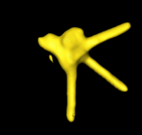
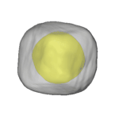
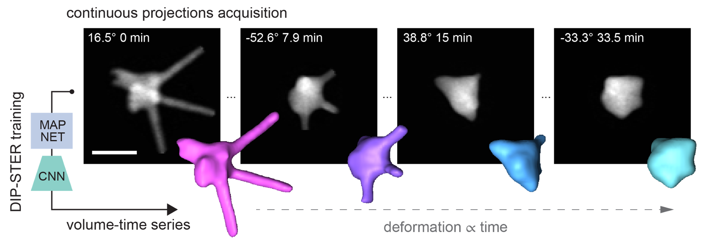
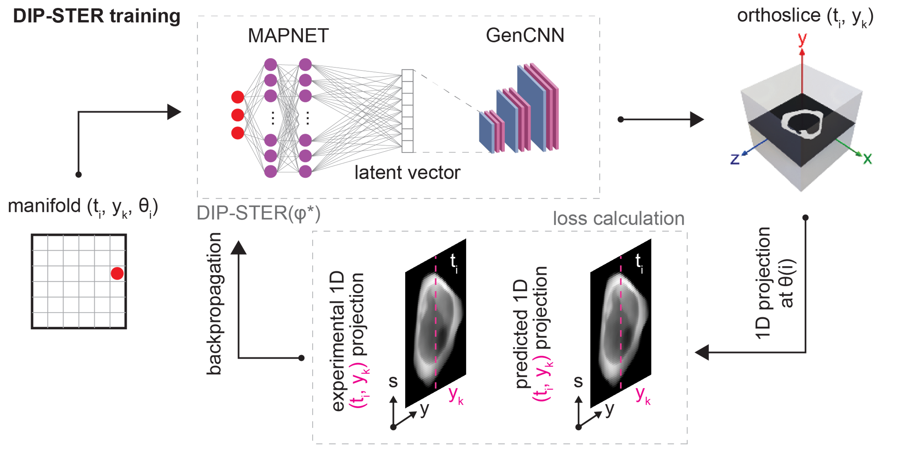

# DIP-STER
Deep Image Priors for Space Time Environment Reconstruction (DIP-STER) is a neural network that uses Deep Image Priors for machine learning using an architecture involving manifold learning and convolution nueral networks in order to determine the resolve a 4D(3D + time) series of electron tomography data during _in situ_ experiments.

<p align="center">
    
    
    
</p>

DIP-STER works by using an implicit neural representation of a volume time series that *implicitely* regularizes for smoothness in time and along the **x** and **z** directions (assuming rotation around **y**). Coupled with a GRS-style tilt scheme that involves large tilt steps, these priors promote decoupling changes in the tilt series that originate from tilting from the actual sample dynamics.  

<p align="center">
    
</p>

The network takes in a 3-coordinates $(t_i, y_k, \theta_i)$ manifold, encodes it it via a FC net into a latent vector, and finally decodes it into a 2D orthoslice of the volume-time series. During training, this orthoslice is reprojected at angle $\theta_i$ and compared with the experimental (1D) projection at time $t_i$ and position $y_k$. 

<p align="center">
    
</p>

## 1. Installation

To be completed and further tested ...

```bash
# 1. CUDA-depended libraries, match CUDA version to your GPU
conda install -c pytorch -c nvidia -c conda-forge -c astra-toolbox -c aahendriksen \
    pytorch torchvision pytorch-cuda=12.8 tomosipo astra-toolbox=2.4

# 2. The package and its pip dependencies
pip install -e dipster-bare
```

## 2. Usage 

The main code is in `dipster_bare` (the name comes from previous version that included heavy dependencies to companion libraries!) and Jupyter notebooks with typical usage are included in `notebooks`.

All the notebooks will assume that a continuous tilt series is available as .tiff (but .mrc files can also be loaded with your preferred method) with angles and times metadata in a separate, 2-column .csv file.

We advise starting with `Train.ipynb` to confirm the code runs on your computer (friendlier test notebooks, additional doc and test data will follow shortly) and get a feeling for the different hyperparameters. `Train_Hypertune.ipynb` follows the same structure but allows for runing an automatic hyperparameter study with [Optuna](https://optuna.org).

In addition, the `Moving_window_tomo.ipynb` notebook includes routines for moving window TV, EM and SIRT reconstructions, try it yourself!

## 3. Citations and acknowledgments
See the preprint at: https://arxiv.org/abs/2603.29462

DIP-STER draws inspiration from many great works including but not limited to:

[Time Dependent Deep Image Priors](https://github.com/jaejun-yoo/TDDIP)\
[Tomosipo](https://github.com/cicwi/tomosipo) and its [algorithms](https://github.com/ahendriksen/ts_algorithms)

Thank you!

## 4. Contributors
Timothy Craig - tim.craig@uantwerpen.be\
Adrien Moncomble - adrien.moncomble@uantwerpen.be\
Robin Girod - robin.girod@uantwerpen.be